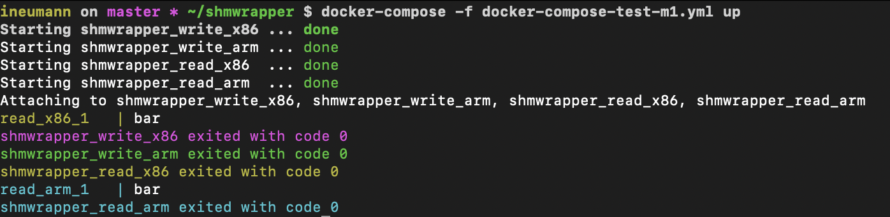
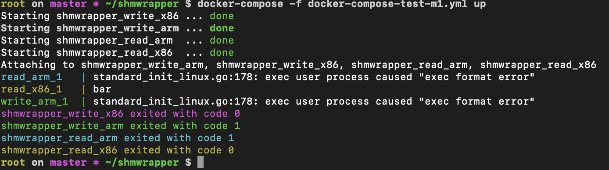

# Shared memory simple wrapper

## Table of content

[[_TOC_]]

## Description

Use shared memory as a cache with keys and values.

This project aims to check if containers can be able to share IPC's host and if that is natively the case for containers accross the same kubernetes pod.

Spoiler: yes !

## Git repositories

* main repo: https://gitlab.comwork.io/oss/shmwrapper
* github mirror backup: https://github.com/idrissneumann/shmwrapper
* gitlab mirror backup: https://gitlab.com/ineumann/shmwrapper

## Getting started

### Build the command

```shell
$ make all
```

### Getting help

```shell
$ ./shmwrapper -h
```

### Put a value in the shared memory

```shell
$ ./shmwrapper -w foo bar
```

### Get a value in the shared memory

```shell
$ ./shmwrapper -r foo
bar
```

### Remove a value in the shared memory

```shell
$ ./shmwrapper -c foo
```

## Testing with containers

### Testing with docker-compose

```shell
$ docker-compose -f docker-compose-test.yml up
```

### Testing with kubernetes

See [this md file](./kubernetes/README.md)

### Test with ready to use hub docker images

See this [image on docker hub](https://hub.docker.com/repository/docker/comworkio/shmwrapper)

The image is providing tags for x86 and arm architecture.

You can also test that both architecture are working on a MacOS Docker desktop:

```shell
$ docker-compose -f docker-compose-test-m1.yml up
```

This will work both on a Mac M1 or intel ship:



But not on a CentOS x86 (you can see that the arm version is not working):


